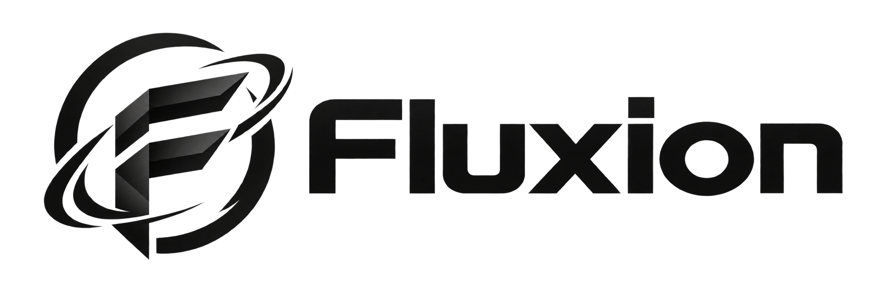

  <picture>
    <source media="(prefers-color-scheme: dark)" srcset="Branding/Fluxion-Logo-OnDark.png">
    
  </picture>

# Fluxion Engine

Open source version of the Fluxion Engine.

Written in C and C++ (C23 / C++23).

## Why open source

The original, closed-source Fluxion had grown too large to keep patching,
refactoring, or restructuring in place. Rather than fight that codebase, it
is being rewritten from scratch, carrying over what still makes sense from
the original (everything written by me), and released as open source.

## License

Fluxion Engine is **dual licensed**. Use it either way:

- **[CPAL-1.0](LICENSES/CPAL-1.0.txt)**, at no cost, with the terms below. See
  [`license.md`](license.md) — there is only one version of that license.
- **[Fluxion Engine Commercial License](LICENSES/LicenseRef-Fluxion-Commercial-1.0.md)**,
  bought and granted separately, which lifts the source-disclosure and
  attribution obligations for whoever holds one.

Nobody holds a commercial license by default. Without one, the CPAL terms are
the terms.

CPAL is a copyleft license, not a permissive one, and two of its terms are
worth knowing before you build on the engine:

- **Attribution (Section 14).** A game you build on this engine does **not**
  have to display anything: Exhibit B of [`license.md`](license.md) says
  attribution is not required in a "Larger Work", which is the license's term
  for anything combining the engine with code of your own. It is owed only by
  someone who ships the engine itself, or a modified version of it, as a
  program with a user interface.
- **Network use (Section 15).** Making the engine or your modifications of it
  usable by other people over a network counts as distribution, and the source
  has to be made available on the same terms.

The copyleft is per file, inherited from the Mozilla Public License 1.1 that
CPAL is built on: changes to the engine's own files stay under CPAL, while
files of your own that merely sit alongside them in a larger work do not.
CPAL is not compatible with the GPL, so the engine cannot be combined with
GPL-licensed code.

Code under `ThirdParty/` is not covered by any of this and keeps its own
license — see [`LICENSES/README.md`](LICENSES/README.md).

Unlike the original, which was written mostly in C#, this version is
written in C and C++ — to natively support more platforms with as few
wrappers as possible, to support at least the scenes of the original
Fluxion, and to be faster than the current C#/C++ version. Its architecture
and extensibility model draw ideas from established AAA engines.

## Building

Every target is a CMake preset — `cmake --list-presets` shows the ones your
host can run.

| Preset | Builds for | Needs |
|---|---|---|
| `windows-msvc` | Windows x64 | Visual Studio, the Vulkan SDK |
| `linux-gcc`, `linux-gcc-release` | Linux x64 | GCC, Ninja, the Vulkan SDK, `libx11-dev` and `libxrandr-dev` |
| `linux-aarch64` | 64-bit ARM Linux, cross-compiled | `gcc-aarch64-linux-gnu`, `g++-aarch64-linux-gnu`, and the target's own libraries under the sysroot |
| `android-arm64` | Android ARM64, cross-compiled | the Android NDK, with `ANDROID_NDK_ROOT` naming it |

The two cross targets build what exists for them and stop, with a message
naming what does not: the window, display, input and clipboard backend for
Android has not been written, so anything above it — the renderer and the
scene — cannot be built there yet. Everything below it can, and is.

Their tests are compiled but not registered with CTest, because a binary for
another machine cannot be started on this one. Compiling them is still worth
doing on its own: it is what checks that the engine's headers and that
toolchain agree.

### The fast way: `Tools/`

- `Tools\windows.ps1 setup | build | test | vs | demo` — Ninja + cl +
  ccache trees at `~\.fluxion\` (a no-op build in a fifth of a second, a
  warm clean rebuild in ~10 seconds; the Visual Studio solution stays for
  the IDE, via `vs`).
- `Tools/linux.sh setup | build | test | gate | watch` — on WSL the
  sources are mirrored onto the Linux disk first, because the `/mnt/c`
  translation layer makes even a do-nothing build cost a minute; the
  whole cycle runs in seconds, `gate` covers all three Linux
  configurations, `watch` re-tests on every change.

`setup` installs what building needs on either side. Run tests with
`ctest -j 8`; the suite is sharded to make that worthwhile.

## Third party

Full text of every license below is in [`LICENSES/`](LICENSES/), one file per
SPDX identifier, along with the copyright line each component's own files
carry. Adding a dependency means adding a row here *and* an entry there — see
[`LICENSES/README.md`](LICENSES/README.md).

| Library | Used for | License |
|---|---|---|
| [pdjson](https://github.com/skeeto/pdjson) | Parsing `.plugin` descriptor files | [Unlicense](LICENSES/Unlicense.txt) (Public Domain) |
| [VulkanMemoryAllocator (VMA)](https://github.com/GPUOpen-LibrariesAndSDKs/VulkanMemoryAllocator) | GPU memory sub-allocation in the Vulkan RHI backend | [MIT](LICENSES/MIT.txt) |
| [D3D12MemoryAllocator (D3D12MA)](https://github.com/GPUOpen-LibrariesAndSDKs/D3D12MemoryAllocator) | GPU memory sub-allocation in the D3D12 RHI backend | [MIT](LICENSES/MIT.txt) |
| The Khronos Group `glcorearb.h` / `wglext.h` / `glxext.h` | GL 1.2+ and WGL/GLX extension declarations in the OpenGL RHI backend | [MIT](LICENSES/MIT.txt) |
| The Khronos Group `khrplatform.h` | Fixed-width types the GL headers are declared in terms of | [MIT wording variant](LICENSES/LicenseRef-Khronos-MIT-Materials.txt) |
| [Nuklear](https://github.com/Immediate-Mode-UI/Nuklear) | The developer panels behind `Fluxion::DebugUI` — sliders and switches for turning a number while watching what it does | [MIT](LICENSES/MIT.txt), or public domain, at the user's choice |

Nuklear offers two alternatives and this repository takes **MIT**: its MIT text
is `LICENSES/MIT.txt` word for word under Micha Mettke's copyright line, while
its public-domain alternative is the Unlicense text with the closing pointer to
<http://unlicense.org/> left off — near enough to be the same offer, not near
enough to be the same file. Taking the alternative whose text is already here
means nothing new has to be shipped for it.

`nuklear.h` also **embeds** Sean Barrett's `stb_rect_pack` and `stb_truetype`,
each carrying the same two alternatives under their own copyright line. They
are what bakes the panels' font, so they are compiled, not merely present —
there are three such notices inside that one file and all three are reproduced
in [`ThirdParty/nuklear/LICENSE`](ThirdParty/nuklear/LICENSE).

The two Khronos rows are split because the files do not agree with each other:
the three generated headers carry `SPDX-License-Identifier: MIT`, while the
copy of `khrplatform.h` here predates that tagging and spells out a notice that
is MIT word for word except that it says "Materials" throughout. Which license
a Khronos header is under is a fact about the *file version* in the tree, not
about Khronos headers in general — so re-read the top of the file whenever one
is refreshed.
